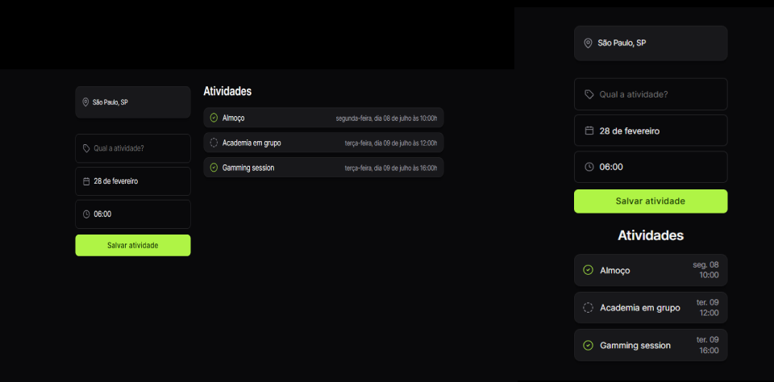

<h1 align="center">NLW-Journey-actividades</h1>
<h2>Sistema de Routeiro de viagens</h2>

Este projeto foi desenvolvido durante o NLW Journey da Rocketseat na trilha HTML+CSS+JS.  

  <a href="#-tecnologias">Tecnologias</a>&nbsp;&nbsp;&nbsp;|&nbsp;&nbsp;&nbsp;
  <a href="#-projeto">Projeto</a>&nbsp;&nbsp;&nbsp;|&nbsp;&nbsp;&nbsp;
  <a href="#memo-licença">Licença</a>

  

 

  

## 🚀 Tecnologias

Esse projeto foi desenvolvido com as seguintes tecnologias:

- HTML e CSS
- Git e Github
- Figma

## 💻Descricao do Projeto
Este projeto consiste em uma versão simplificada de um sistema de roteiro de viagem. O objetivo é fornecer aos usuários uma ferramenta prática para planejar suas viagens de forma organizada e eficiente.

## :memo: Licença

Esse projeto está sob a licença MIT.

---

Feito com ♥ by Paulo Nachava
